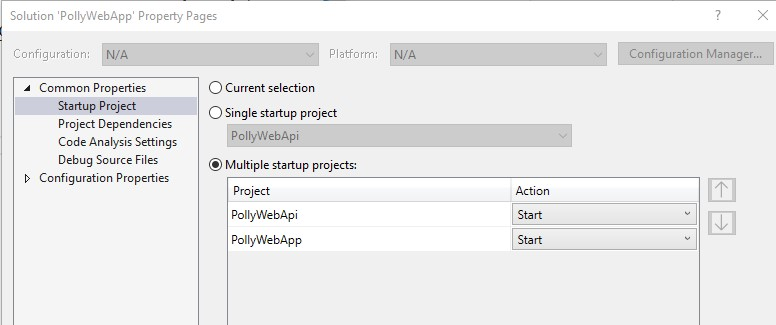
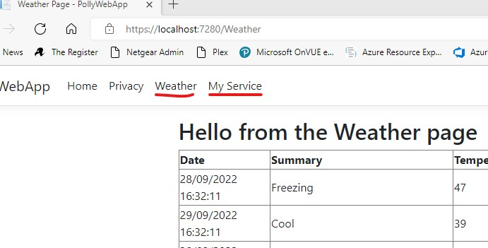

# PollyWebApp

## Overview

Shows some examples of how to use Polly in an ASPNet (Core) MVC webapp calling an ASPNet (Core) WebAPI.

## To run the sample applications
Ensure Visual Studio is set to run both projects at startup.  To do this, right click on the solution file and select "Set Startup Projects...".  This should look like   

When running the application, to hit the test code click on either the Weather or My Service links repeatedly as follows: 

## Implementation detail

The PollyWebApi is a bog standard, out of the box "new ASP.NET Core WebAPI" project.  The template for this API includes a sample API controller that returns faked weather data.  The only thing that has been added is a few new middleware components that can be added to the pipeline to simulate transient errors.  Both these middleware components let the first three requests through unhindered, then affect the 4th and 5th calls, then leave all subsequent calls unhindered.

The PollyWebApp is a bog standard, out of the box "ASP.NET Core Web App (Model-View-Controller)".  To that has been added a new WeatherForecastController that calls the PollyWebApi over HTTP(S) in order to get weather data, and a new MyServiceController that calls an arbitrary MyService to get an abitrary DTO.  This data is returned in views which just displays the data with minimal formatting.  In addition there are a number of Polly retry policies defined that can be applied to either the HttpClient calls or the MyService calls in order to enable transient fault handling behaviour.

[](https://mermaid.live/edit#pako:eNqVUsFO6zAQ_JWVTw8J9JAQlwhVQo8icShCFKkXX9xk01g43rDeUCrEv7OhTl-KuJBT7B3P7OzsuympQlOYhC89xhJvvNuwa20E_R4ohN0K19dddzab_T_5Ah4HfBKoiWGLThpkqJw4uFoz_J1BzdTCal_4R1FYHyPvae9JEALWAlRPNQqYR7cOCIzCO-go-NJjAiFoXKy0kMmFXUweowAyE6e92vXDHShsBC12S-RXX6KNE1l61UaPnGTNW_eMTyPvfKBd-Eo1t44RfPxiH72p58vz8yz-a_JloO0jpo5iwolGJs9Sg0aguIE_s4vLdKIj2T9I8D0afxSNDnE1iWP0fpzkYTSTHIcJHu5_TOzL3eRp9maNNExbwLcSO_EUrQFtXu2oG6uLJdD4TQNJnPRJi-pwks1Afzh-t7KkFm-EFrqjIRu30ZyaFrl1vtK9fR9uhxawRWsK_a2wdn0Qa2z8UGjf6RxwXnkhNkXtQsJT43qh5S6WphDucQTl3c-oj08bwxL-)

Within the PollyWebApp, for calls to the PollyWebApi a Http client is added as recommended, i.e. by calling the AddHttpClient IServiceCollection extension method in the Program.cs class.  Some scenarios of enabling Polly add extra calls to that registration.  Then the WeatherController takes an instance of IHttpClientFactory in the constructor and creates HttpClients from that.  Some scenarios of enabling Polly add extra code in the controller which wrap the HttpClient calls.

The PollyWebApp also has a "MyService" - an arbitrary implementation of a resource that "does something", returns some content and could throw exceptions, and could therefore possibly benefit from transient fault handling.  The MyServiceController takes an instance of IMyService and calls it, optionally wrapping the call in a retry policy if required.

The code as checked in will not use Polly; there is commented out code that can be incrementally uncommented in order to add Polly functionality.  You will often have to comment out other code as you start uncommenting, since there will be multiple declarations of the same variable in different sections of commented out code.  However the checked in code will have transient faults in the 4th and 5th invocations of either the Weather API or MyService.

The intention is to start demoing with no fault handling policy at all; then use the recommended way for HTTP clients; then break that down to understand what's going on in order to be able to generalize use of Polly for any kind of operation that could benefit from transient fault handling.